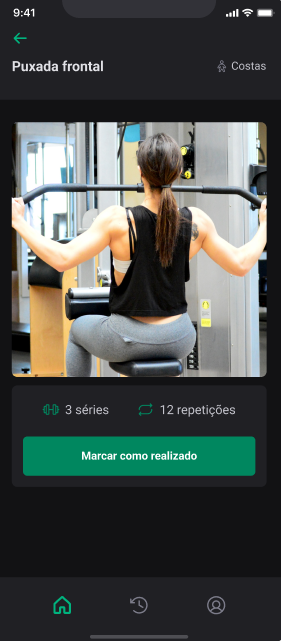
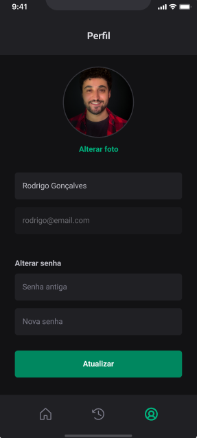

## 💻 Projeto

# Ignite Gym Back-end

[](https://github.com/rodrigo-teixeira-silva/ignite-gym-back-end/new/main)

# Sobre o projeto

Back end da aplicação gym

 **</>Codelink**.

Aplicação utilizando framework react native com login, cadastro, troca de foto de usuário com respostas de erro do back end

## Layout mobile
### Tela SignIn com retorno de erro do back-end


### Tela de signUp com mensagem de error do back-end






# Tecnologias utilizadas
## Aplicação

- [Native base](https://nativebase.io)
- [TypeScript](https://www.typescriptlang.org/docs/)
- [Expo](https://docs.expo.dev/?utm_source=google&utm_medium=cpc&utm_content=search&gclid=CjwKCAjwxOymBhAFEiwAnodBLE4O6-g49a-HniPnrQt_l-6t_CNvui4z2_h31jUCUpesirHbFYmI_hoC39IQAvD_BwE)

- [Google fonts](https://docs.expo.dev/develop/user-interface/fonts/#use-a-google-font)
- [Babel -plugin-module-resolver](https://github.com/tleunen/babel-plugin-module-resolver#readme)
- [Styled components](www.google.com/url)
- [Use google fonts](https://docs.expo.dev/develop/user-interface/fonts/#use-a-google-font)
-[phosphor icons](https://phosphoricons.com)
- [React Navigation](https://reactnavigation.org)
-[Image picker](https://docs.expo.dev/versions/latest/sdk/imagepicker/)
- [NPM](https://docs.npmjs.com)
- [AsyncStorage](https://docs.expo.dev/versions/latest/sdk/async-storage/)

# Funcionalidades do projet

- [x] Tela SignIn 
- [x] Tela SignUp
- [x] Tela Home
- [x] Tela de Treino do dia 
- [x] Tela de histórico de execícios
- [x] Perfil


# Como executar o projeto

```bash
# clonar repositório
git clone https://github.com/rodrigo-teixeira-silva/Ignite_Gym.git

# entrar na pasta do projeto.
 cd Projeto Ignite_Gym

# instalar o pacote node_modules.
 npm install

# Executar o projeto
 npx expo run start
```
## Aplicação Mobile
Pré-requisitos: npm 

# Autor

Rodrigo Teixeira Silva


## [Linkedin](https://www.linkedin.com/in/rodrigo-teixeira-silva/)


